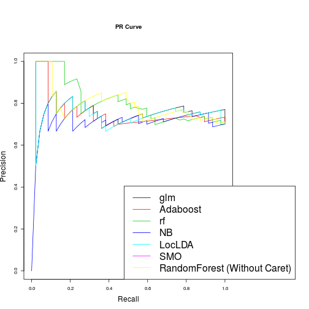
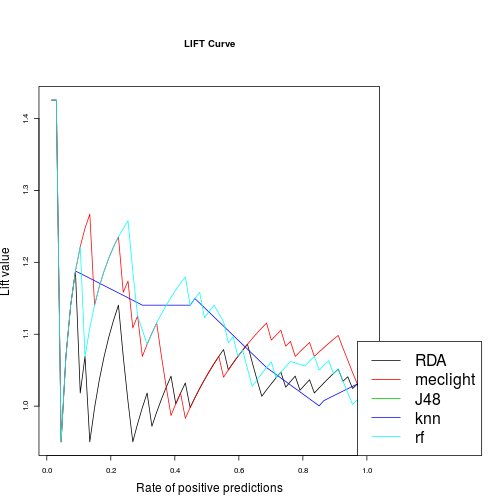

For this task I use caret, dplyr, ROCR as mentioned in the "task.pdf" file. In addition
I use RWeka to read the arff file and klaR for manual machine learning algorithms. 


```r
library(caret)
library(RWeka)
library(klaR)
library(dplyr)
library(ROCR)
library(randomForest)
```

Set a seed to get reproducible results. 


```r
set.seed(8)
df=read.arff("alk_data_weka_feature_selection.arff")
head(df)
```

```
##   ICVisitsNorm AnzLoginsNorm UniqueICVisited
## 1     0.244133      0.853325              25
## 2     0.034471      0.052856               7
## 3     0.211473      0.517990              27
## 4     0.119250      0.250426              13
## 5     0.011982      0.055118               2
## 6     0.122892      1.000000              12
##   Anzahl_ALK_Standalone_MailsNorm IC_MSD_Derma.besucht area_2_recoded
## 1                        0.034224                    0    Pneumologie
## 2                        0.032173                    0   Allergologie
## 3                        0.042770                    0    Pneumologie
## 4                        0.045315                    1   Allergologie
## 5                        0.000000                    0    Pneumologie
## 6                        0.024096                    0    Pneumologie
##   Target
## 1    Yes
## 2    Yes
## 3    Yes
## 4    Yes
## 5     No
## 6    Yes
```

Output distribution of the "Target" variable. The dataset is unbalanced. 
There are different ways to handle it (e.g. oversampling, undersampling, assigning class weights, ROC probability etc).
I won't go into further details of it. 


```r
counts<-table(df$Target)
barplot(counts, main = "Target Distribution (Unbalanced Dataset)", xlab="Target Variables")
```


Label encoding to convert factor columns to numeric columns. We have
only one variable  "area_2_recoded" that needs to be converted. A simple way is to only convert this variable;
however, this is not a practical option for datasets with many variables. Below I mention three ways to handle this. 


```r
indx <- sapply(select(df, -Target), is.factor)
df[indx] <- lapply(df[indx], function(x) as.numeric(x))

################Second technique################
#df$area_2_recoded=as.numeric(df$area_2_recoded)
################Third Technique#################
#for (i in colnames(select(df, -Target))){
#  df[[i]]=as.numeric(df[[i]])
#}
```

I split the data into training and testing set. I use the simple 80/20 rule to split the dataset. 
For manual classifiers I use training and testing set. For caret-based classification, I use the training set with N-fold (N=10)
to train and validate the classifier and then I use the test set to assess the performance of the classifier. 


```r
split=0.80 
#trainIndex = sample(1:nrow(df), size=split*nrow(df)) ##Without caret function and does the same as the line below
trainIndex <- createDataPartition(df$Target, p=split, list=FALSE)
data.train <- df[ trainIndex,]
data.test <- df[-trainIndex,]
x.test <- select(data.test,-Target)#data_test[,1:6]
y.test <- select(data.test, Target)#data_test[,7]
```

Method for manual classifiers. I use klaR library. 
This method takes the name of a classifier, training data, test data and delivers the predicted probabilities. 
I noticed that some algorithms contain the predicted probabilities in the "posterior"
option and other simply deliver the probabilities. I add an if-else check to verify this.


```r
manual.classifier<-function(data.train, x.test,algorithm){
  model.manual <- algorithm(Target ~. , data=data.train)
  predictions <- predict(model.manual, newdata=x.test, type = "prob")
  
  return (if ('posterior' %in% names(predictions)) (predictions$posterior[,2]) 
          else (predictions[,2]))
}
```

The "caret.classifier" method takes the name of the classifier, training data, test data, tuning parameter and 
delivers the predicted probabilities. 


```r
caret.classifier<-function(data.train, x.test, method.name, grid.tuning=NULL){

  model.train <- train(Target~., data=data.train, method=method.name, trControl=trainControl(method="cv", number=10, repeats=3),
                       tuneLength=5, preProc = c("center","scale"), tuneGrid=grid.tuning)
  plsClasses <- predict(model.train, newdata = x.test, type="prob")
  return (plsClasses[,2])
}
```

Plotting ROC, lift, Sensitivity/specificity and Precision-recall curve. Instead of writing three different methods I write 
a single method "draw.plots" that serves the purpose. The "plottype" parameters decide the type of curve to plot.


```r
return.plotType<-function(plotype){
  lowercase<-tolower(plotype)
  
  if(lowercase=="pr"){
    decision<-c("prec", "rec")
  }else if(lowercase=="lift"){
    decision<-c("lift","rpp")
  }else if(lowercase=="ss"){
    decision<-c("sens","spec")
  }else
    decision<-c("tpr","fpr")
  return(decision)
}

draw.plots<-function(predicted.labels, actual, plottype){
  plot.decision<-return.plotType(plotype = plottype)
  column.names<-names(predicted.labels)
  actual.output<-rep(list(actual), length(column.names))
  pred <- prediction(predicted.labels, actual.output)
  perf <- performance(pred, measure = plot.decision[1], x.measure = plot.decision[2])
  par(mar=c(5.1, 4.1, 9.1, 13.1), xpd=TRUE)
  plot(perf, col= as.list(1:10), cex.lab=1.5, cex.axis=2.5, cex.main=1.5, cex.sub=2.5)
  title(paste(toupper(plottype), "Curve", sep=" "))
  legend("bottomright", legend = column.names, col=1:length(column.names), lty=1, cex=2, inset=c(-0.3,0))
}
```

Define a list object "classifiers", where we can define machine learning algorithms.
From the caret package I use "glm", "adaboost" and "rf"  and from the manual classifiers I use "NaiveBayes" and "loclda".
 
glm=Generalized Linear Model

rf=Random Forest (caret)

randomForest (without caret)
NaiveBayes (klaR)

loclda=Localized Linear Discriminant Analysis (klaR)

SMO= Sequential minimal optimization (RWeka)


```r
classifiers<-list()
classifiers[["glm"]]<-"glm"
classifiers[["Adaboost"]]<-"adaboost"
classifiers[["rf"]]<-"rf"
classifiers[["NB"]]<-NaiveBayes
classifiers[["LocLDA"]]<-loclda
classifiers[["SMO"]]<-SMO
classifiers[["RandomForest (Without Caret)"]]<-randomForest


idx<-sapply(classifiers, is.character)
idx1<-sapply(classifiers, is.function)
classifiers[idx] <- lapply(classifiers[idx], function(x) caret.classifier(data.train, x.test,x))
classifiers[idx1] <- lapply(classifiers[idx1], function(x) manual.classifier(data.train, x.test,x))
```

```
## Warning in FUN(X[[i]], ...): Numerical 0 probability for all classes with
## observation 51
```

```
## Warning in FUN(X[[i]], ...): Numerical 0 probability for all classes with
## observation 55
```

```
## Warning in FUN(X[[i]], ...): Numerical 0 probability for all classes with
## observation 56
```

```
## Warning in FUN(X[[i]], ...): Numerical 0 probability for all classes with
## observation 63
```

```r
par(mfrow=c(3,1),fig=c(0,1,0,1))
draw.plots(predicted.labels =classifiers,actual = y.test$Target, plottype="ROC")
```


```r
draw.plots(predicted.labels =classifiers,actual = y.test$Target, plottype="lift")
```


```r
draw.plots(predicted.labels =classifiers,actual = y.test$Target, plottype="pr")
```



```r
draw.plots(predicted.labels =classifiers,actual = y.test$Target, plottype="ss")
```


Another option is to create a list ("test.caret.manual") and then test different manual and 
caret-based classification algorithms (with "tuneGrid" parameters). I use following algorithms:

rda=Regularized Discriminant Analysis (klaR)

meclight=Minimal Error Classification (klaR)

J48=C 4.5 Decision Tree

knn=k-Nearest Neighbors

nn=Artificial Neural Network 

rf=Random Forest


```r
test.caret.manual<-list()
test.caret.manual[["RDA"]]<-manual.classifier(data.train, x.test,rda)
test.caret.manual[["meclight"]]<-manual.classifier(data.train, x.test,meclight)
test.caret.manual[["J48"]]<-caret.classifier(data.train, x.test,"J48")
test.caret.manual[["knn"]]<-caret.classifier(data.train, x.test,"knn", grid.tuning =data.frame(k=1:10))
#test.caret.manual[["NN"]]<-caret.classifier(data.train, x.test,"nnet")
test.caret.manual[["rf"]]<-caret.classifier(data.train, x.test,"rf", grid.tuning = expand.grid(.mtry = c(1:5)))

par(mfrow=c(3,1),fig=c(0,1,0,1))
draw.plots(predicted.labels =test.caret.manual,actual = y.test$Target, plottype="ROC")
```


```r
draw.plots(predicted.labels =test.caret.manual,actual = y.test$Target, plottype="lift")
```



```r
draw.plots(predicted.labels =test.caret.manual,actual = y.test$Target, plottype="pr")
```


```r
draw.plots(predicted.labels =test.caret.manual,actual = y.test$Target, plottype="ss")
```


